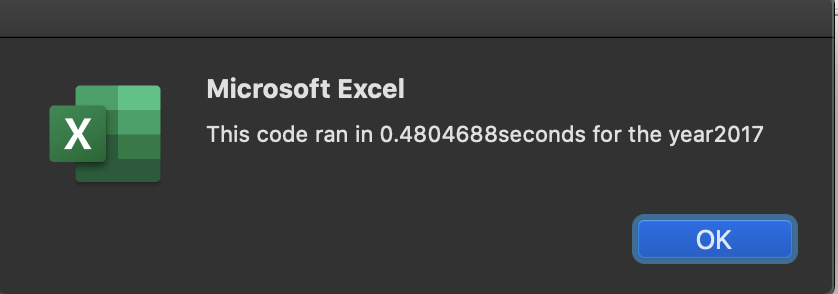
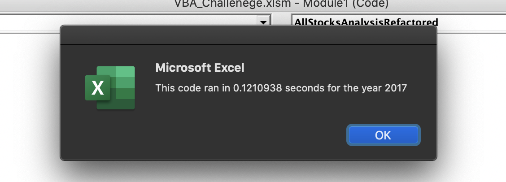

# An Analysis for Stocks 2017 & 2018
## Overview of Project
### Purpose
The purpose of this analysis was to compare stocks from 2017 and 2018. Comparing stocks from multiple years gives a clear understanding of how that stock did in the past and how it can possibly do in the future. By comparing multiple stocks gives a clear understanding to the user of the different industries and how they preform. So, when deciding to invest in stocks, you can have an understanding of what industries are doing better than others and when that industry does well. Our client wanted to compare the different stocks to one in particular to show if there was a better option for the client to invest in.

## Results
The results of this analysis was comparing the Total Volumes and Return of each stock ticker. When running the refactored code, you can see that just a year difference had drastic total volume and return values. When refactoring the code, we decided to use an Index to reference the tickers; with adding the Index, we can see that the time it took to run the code with much faster with refactoring. 

#### Original Stock Analysis Run Time


#### Refactored Stock Analysis Run Time


Using the refactored code, I believe, gets a more faster and more accurate analysis of the stocks in 2017 and 2018 because of the way we used an Index for the tickers. For the Return of Investment, using that Index gives more accurate data to then calculate the R.O.I. Using this refactored code is a more efficient and more accurate way of displaying the results the client is looking for. 


#### Refactored Return on Investment Code
```
 If Cells(j, 1).Value = tickers(tickerIndex) And Cells(j - 1, 1).Value <> tickers(tickerIndex) Then
  tickerStartingPrices(tickerIndex) = Cells(j, 6).Value
 End If
```

## Summary
### Advantages & Disadvantages to Refactoring
The advantages to refactoring code is that you can make it more concise and effective with less lines of code. Making it more concise can make it more readable for someone who might not know what you are trying to accomplish and it makes it cleaner and more organized. I also think it helps with bugs and then troubleshooting those issues. 

Some disadvantages of refactoring code, is when it is a big file, it can make it more complicated to put what needs to be in the code. When writing such a big file, having things longer can make sure that is exatly what you are trying to run. Another disadvantage to refactoring is if the user doesn't understand what you are trying to run, that could make things much more confusing for them and would have more questions about the code (unless you put really detailed comments about it). 

### Advantages & Disadvantages to Original VBA Code
An advantage of refactoring the VBA script is that we made it more concise and easier to read through all those lines. By using the ticker Index, it made it more clear of what was happening within that code. It looks better and you know exactly what is going to run when you press play.

#### Refactored Ticker Index Code
```
  Dim tickerIndex As Integer
  tickerIndex = 0
```

A disadvantage of refactoring the VBA script is that some of the logic had to be reconsidered, making sure that is what exactly what we want to calculate and have in the final product. Another disadvantage was when using the ticker Index, it made things have to add more accuracy, creating more work for some of the "If-Then" statements. For example, when calculating the starting and ending prices for the Return, on the refactored, you would have to add the tickerIndex instead of the original where it was just the starting and ending prices.

#### Original Code
```
 If Cells(j, 1).Value = ticker And Cells(j - 1, 1).Value <> ticker Then
    startingPrice = Cells(j, 6).Value
 End If
            
      
 If Cells(j, 1).Value = ticker And Cells(j + 1, 1).Value <> ticker Then
   endingPrice = Cells(j, 6).Value
 End If
 ```
 
 #### Refactored Code
 ```
 If Cells(j, 1).Value = tickers(tickerIndex) And Cells(j - 1, 1).Value <> tickers(tickerIndex) Then
   tickerStartingPrices(tickerIndex) = Cells(j, 6).Value
 End If
 
 If Cells(j, 1).Value = tickers(tickerIndex) And Cells(j + 1, 1).Value <> tickers(tickerIndex) Then
   tickerEndingPrices(tickerIndex) = Cells(j, 6).Value
 End If
```
